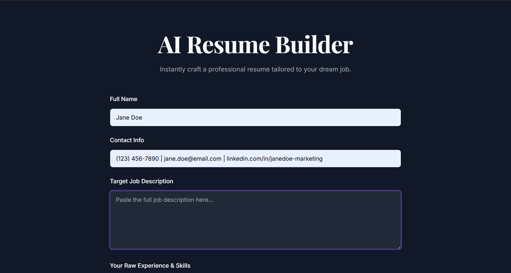
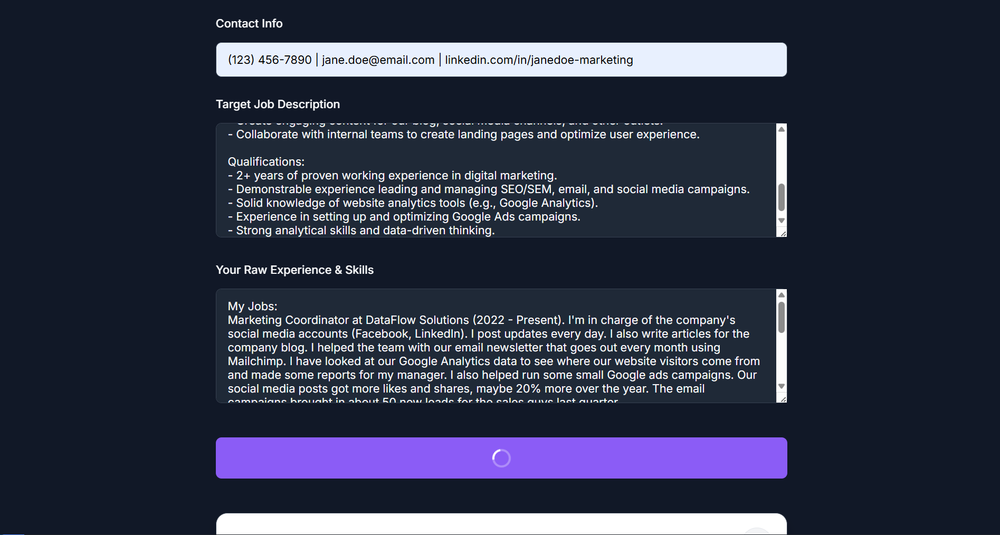
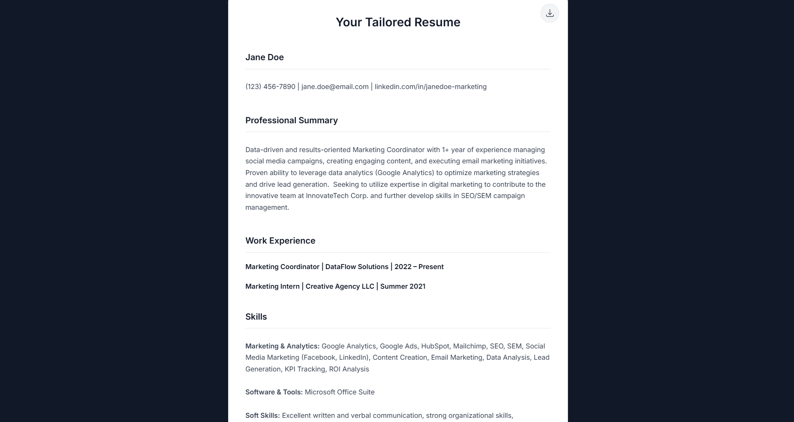

# Pause - AI Resume Builder

Pause is an AI-powered resume builder that transforms your experience into job-ready resumes using Google's Gemini and LangChain. Just enter your professional details—Pause handles the writing, formatting, and tone to help you stand out. Fast, smart, and tailored to your dream role.

🔗 **[Live Demo](https://pause-33il.onrender.com/)** (Note: The application may take up to 50 seconds to load due to hosting constraints on the free tier.)

## Features

- **AI-Powered Content Generation**: Automatically writes compelling summary, experience, and skills sections based on your input.
- **Context-Aware Generation**: Utilizes a RAG (Retrieval-Augmented Generation) approach with resume templates for high-quality, relevant content.
- **Customizable Tone & Style**: Tailor your resume's tone (e.g., Professional, Creative, Corporate) to match the job you're applying for.
- **Simple & Fast**: Go from raw details to a polished resume in minutes.
- **Editable Output**: Review, edit, and copy the generated resume content directly from the user-friendly interface.
- **Responsive UI**: Clean and intuitive interface built with Bootstrap, accessible on any device.

## Tech Stack

- **Frontend**: HTML, CSS (Bootstrap)
- **Backend**: Python, Flask
- **AI/LLM**: Google Gemini (`gemini-1.5-flash-001`) via LangChain
- **Embeddings**: `models/embedding-001` via `GoogleGenerativeAIEmbeddings`
- **Vector Store**: FAISS (for RAG)
- **Environment Management**: `python-dotenv`

## Installation & Setup

### 1. Clone the Repository

```bash
git clone https://github.com/your-username/pause-ai-resume-builder.git
cd pause-ai-resume-builder
```

### 2. Create and Activate a Virtual Environment

#### Windows

```bash
python -m venv venv
venv\Scripts\activate
```

#### macOS / Linux

```bash
python3 -m venv venv
source venv/bin/activate
```

### 3. Install Dependencies

```bash
pip install -r requirements.txt
```

### 4. Set Up Environment Variables

#### Create a .env file in the root of the project:

```bash
GOOGLE_API_KEY=your_google_api_key
PORT=10000
```

### 5. Set Up Environment Variables

- Create an `resume_examples.txt` file in the project root with sample resume examples (optional, as the app includes default examples).
- Example format for `resume_examples.txt`:
```
[Professional Summary Example]
  Dynamic and results-oriented Software Engineer with 5+ years of experience in developing, testing, and maintaining scalable web applications. Proficient in Python, Django, and React. Seeking to leverage expertise in full-stack development to contribute to the innovative team at [Company Name].

[Work Experience Example - Action Verbs]

- Led the development of a new customer-facing feature using React and Redux, resulting in a 15% increase in user engagement.
- Architected and implemented a RESTful API service with Python and Django, improving system response time by 30%.
- Collaborated with a cross-functional team of 5 to define project requirements and deliver solutions ahead of schedule.
- Optimized database queries and caching mechanisms, reducing server load by 20%.

[Skills Section Example]

- Languages: Python, JavaScript, SQL, HTML/CSS
- Frameworks: Django, Flask, React, Node.js
- Databases: PostgreSQL, MongoDB, Redis
- Tools: Docker, Git, Jenkins, AWS

[Project Section Example]

- Personal Portfolio Website: Developed a fully responsive personal website using Flask and deployed on Heroku to showcase projects.
- E-commerce Analytics Dashboard: Built a data visualization tool with Plotly Dash to track sales metrics and customer behavior for a mock e-commerce site.
```

### 6. Running the App

```bash
python app.py
```

#### Visit the app at: http://localhost:10000







## File Structure

```
├── app.py                    # Main Flask application
├── templates/                # HTML templates (index.html)
├── static/                   # CSS or JS assets
├── resume_templates.txt      # (Optional) RAG data examples
├── .env                      # Environment variables
├── requirements.txt          # Python dependencies
└── README.md                 # Project documentation
```

## Dependencies

- Flask
- python-dotenv
- langchain
- langchain-google-genai
- langchain-community
- faiss-cpu
- numpy

#### Install them all with

```bash
pip install -r requirements.txt
```

## Troubleshooting

- API Key Error: Double-check that your GOOGLE_API_KEY is correct and has access to Gemini.
- FAISS installation issues: If you run into errors with faiss-cpu, try reinstalling or switching to faiss-gpu (if you have a compatible GPU).
- Port Conflict: Change the PORT in .env if 10000 is in use.

## How It Works

1. Resume examples from resume_examples.txt are loaded and chunked using CharacterTextSplitter.
2. These chunks are embedded with GoogleGenerativeAIEmbeddings and stored in FAISS for semantic search.
3. When a user submits input, the app searches for relevant examples from the vector store.
4. These examples + user input are sent to Gemini via a structured PromptTemplate.
5. Gemini returns a tailored resume, which is parsed and rendered in HTML.

## License

This project is licensed under the MIT License. See the LICENSE file for details.
